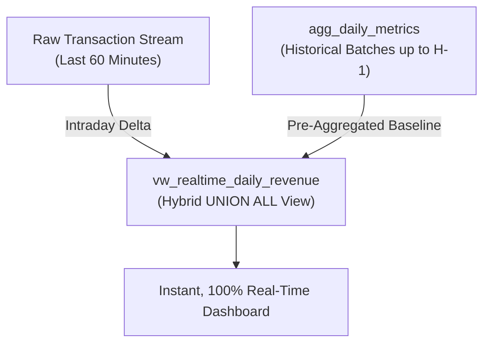
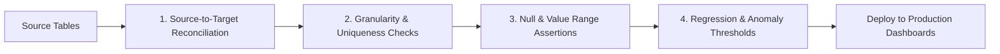

# 🧠 Bonus Follow-Up Questions: SQL Views & Aggregation Layer Design (2.43)

---

## Question 1: Automatic Propagation of View Changes to Dashboards

> **Prompt:** *When a view definition changes, do existing dashboards automatically use the new definition? Why or why not?*

### 🔍 Technical Explanation

**Yes, existing dashboards automatically use the updated definition on their next query execution.**

#### Architectural Reasons:
1. **Views Store Logic, Not Data:**
   * A standard SQL view (`CREATE VIEW vw_...`) is a **virtual table**. The database engine does not physically store data on disk for views; instead, it stores the SQL query text and execution plan in the database system catalog.
2. **Dynamic Compilation at Runtime:**
   * Every time a dashboard, notebook, or application executes `SELECT * FROM vw_active_customers`, the database engine parses the view definition, merges outer query predicates (predicate pushdown), and executes the updated query directly against the underlying tables.
   * Updating a view with `CREATE OR REPLACE VIEW` instantly updates the single source of truth for all downstream consumers without requiring any code changes in the dashboards.

#### ⚠️ Critical Real-World Exceptions:
* **Client-Side & BI Caching:** If a dashboard tool utilizes client-side caching (e.g., Streamlit `@st.cache_data`, Tableau Data Extracts, PowerBI Import Mode, Looker PDTs), the dashboard will continue displaying cached data until the cache TTL expires or a cache invalidation webhook is triggered.
* **Materialized Views:** Unlike standard views, Materialized Views physically persist result sets. Changing a materialized view requires a schema migration and a `REFRESH MATERIALIZED VIEW` command to re-populate the persisted data.

---

## Question 2: Handling Data Freshness & Real-Time Metrics Between Refresh Cycles

> **Prompt:** *If an aggregated table is computed once per hour, what happens to data between refresh cycles? How would you handle real-time metrics?*

### 🔍 Technical Explanation

If an aggregated table (`agg_daily_metrics`) is computed once per hour, data generated between refresh cycles is **omitted from the pre-aggregated table**, making the dashboard stale by up to 59 minutes.



### Engineering Solutions for Real-Time Analytics:

1. **The Lambda / Hybrid View Pattern (Best Practice):**
   * Construct a dynamic view that combines historical pre-aggregated data with a lightweight scan of recent intraday transactions:
   ```sql
   CREATE VIEW vw_realtime_daily_revenue AS
   -- Historical data from high-speed pre-aggregated table
   SELECT 
       aggregation_date, 
       metric_value AS revenue, 
       row_count
   FROM agg_daily_metrics
   WHERE aggregation_date < CURRENT_DATE
   
   UNION ALL
   
   -- Intraday real-time delta from raw orders table
   SELECT 
       DATE(order_date) AS aggregation_date, 
       SUM(order_amount) AS revenue, 
       COUNT(*) AS row_count
   FROM orders
   WHERE order_date >= CURRENT_DATE AND status = 'Completed'
   GROUP BY DATE(order_date);
   ```
   * *Benefit:* Historical queries remain instant, while today's metrics are 100% real-time.

2. **Incremental Micro-Batching (dbt / Apache Airflow):**
   * Refresh only newly added or modified rows using an `updated_at >= (SELECT MAX(updated_at) FROM agg_table)` filter every 1–5 minutes.

3. **Continuous Streaming Aggregation (ClickHouse / Materialize / Apache Flink):**
   * Use streaming engines that continuously maintain materialized state as events arrive on message brokers (e.g., Kafka).

---

## Question 3: Quality Assurance & Pre-Release Testing Framework for Data Layers

> **Prompt:** *How would you test that a view or aggregated table is correct before releasing it to dashboards?*

### 🔍 Technical Explanation

Before promoting view definitions or aggregation tables to production, data engineering teams implement a multi-stage automated test suite:



### 1. Source-to-Target Mathematical Reconciliation (Parity Audits)
Assert that aggregates calculated by the view/table match the raw baseline calculation:
```sql
-- Parity Test: Aggregate Revenue vs Raw Orders Revenue
SELECT 
    (SELECT SUM(metric_value) FROM agg_daily_metrics WHERE metric_name = 'total_revenue') AS agg_revenue,
    (SELECT SUM(order_amount) FROM orders WHERE status = 'Completed') AS raw_revenue,
    ABS(
        (SELECT SUM(metric_value) FROM agg_daily_metrics WHERE metric_name = 'total_revenue') - 
        (SELECT SUM(order_amount) FROM orders WHERE status = 'Completed')
    ) AS reconciliation_diff;
-- Assertion: reconciliation_diff MUST be 0.00
```

### 2. Primary Key Uniqueness & Grain Integrity
Validate that no duplicate rows exist for the defined grain:
```sql
SELECT aggregation_date, metric_name, COUNT(*)
FROM agg_daily_metrics
GROUP BY aggregation_date, metric_name
HAVING COUNT(*) > 1;
-- Assertion: Query MUST return 0 rows
```

### 3. Not-Null & Schema Contract Assertions
Ensure all dimensional columns, timestamps, and metric values satisfy mandatory constraints (`dbt test` or `Great Expectations`):
* `updated_at IS NOT NULL`
* `metric_value >= 0`
* `customer_id IS NOT NULL`

### 4. Automated CI/CD Regression Testing
Incorporate automated testing scripts (like `assignment-33-python.py`) in GitHub Actions that spin up staging databases, execute view creation scripts, and validate output assertions before merging pull requests.
