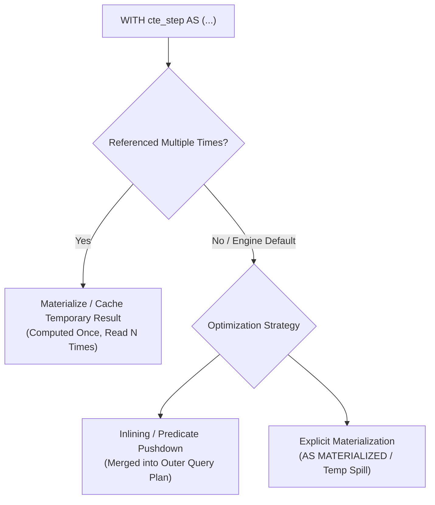
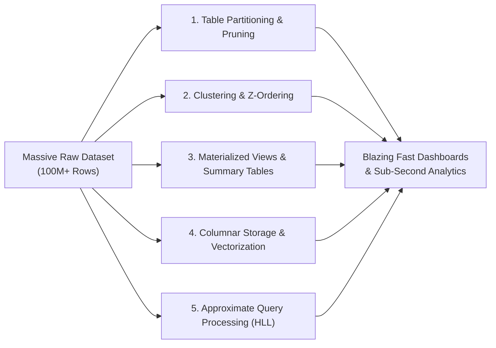

# 🧠 Task 5: Analytical SQL Optimization - Follow-Up Technical Q&A

---

## Question 1: High-Cardinality Column Indexing & Tradeoffs

> **Prompt:** *You created a WHERE clause that filters on a high-cardinality column (many distinct values). An index would speed this up significantly. Explain how an index on that column would improve query performance and what the tradeoff is.*

### 🔍 Technical Explanation

A **high-cardinality column** contains a large number of unique or distinct values (e.g., `transaction_id`, `customer_id`, `uuid`, `timestamp`). 

#### How an Index Improves Query Performance:
1. **From $O(N)$ Table Scan to $O(\log N)$ B-Tree Lookup:**
   * Without an index, the database engine must execute a **Full Table Scan (Sequential Scan)**, inspecting every single page on disk and evaluating the filter condition against all $N$ rows (e.g., reading 100 million rows from disk).
   * A **B-Tree index** organizes values in a balanced hierarchical search tree. Searching for a specific value or range requires traversing only the height of the tree (typically 3 to 4 I/O operations), finding the exact row pointer/tuple ID (TID) in $O(\log N)$ time.
2. **Index Range Scans & Covering Indexes:**
   * For range queries (e.g., `transaction_date >= '2024-01-01'`), the engine performs an **Index Range Scan**, jumping straight to the start leaf node and reading horizontally across linked leaf pages.
   * If a **covering composite index** is created (e.g., `CREATE INDEX idx_trans_opt ON transactions(transaction_date, amount) INCLUDE (customer_id, product_id)`), the database can satisfy the query entirely from the index tree (*Index-Only Scan*), completely eliminating random disk reads to the heap table.

#### ⚖️ Architectural Tradeoffs:
| Tradeoff Dimension | Impact Details |
| :--- | :--- |
| **1. Write Latency Overhead (DML Penalty)** | Every `INSERT`, `UPDATE`, or `DELETE` on the indexed table must synchronously update the B-Tree structure. High write throughput or bulk ingestion pipelines experience significant slowdown due to index page splits and rebalancing. |
| **2. Storage & Memory Bloat** | Indexes consume disk space (often 20%–50% of the raw table size). Crucially, indexes compete for precious space in the database **Buffer Pool / Shared Buffers RAM cache**, potentially evicting hot table pages. |
| **3. Optimizer Overhead** | Excessive indexes increase query planner compilation time and risk the Cost-Based Optimizer (CBO) choosing suboptimal access paths due to outdated index statistics. |

---

## Question 2: CTE Caching vs Recalculation Across Database Engines

> **Prompt:** *For the CTE approach, if you need to reference the same intermediate result multiple times, does the database recalculate it, or does it cache it? (Answer: Most databases cache it, improving efficiency. Some allow explicit materialization. Explain what you learned about your database's behavior.)*

### 🔍 Technical Explanation

The behavior of Common Table Expressions (CTEs) when referenced multiple times depends heavily on the **query optimizer** and the underlying database engine. Modern SQL systems handle CTEs using two primary strategies: **Materialization (Caching)** and **Inlining (Subquery Unfolding)**.

#### Engine-by-Engine CTE Execution Behaviors:

1. **PostgreSQL (PostgreSQL 12+ vs Pre-PG 12):**
   * *Pre-PG 12:* CTEs acted as strict **optimization fences**. PostgreSQL *always materialized* the CTE into a temporary memory buffer and read from it, preventing outer WHERE filters from pushing down into the CTE.
   * *PostgreSQL 12+:* Defaults to **Inlining** if the CTE is referenced only once (allowing predicate pushdown). If referenced *multiple times*, it automatically **caches (materializes)** the intermediate result so it is calculated only once.
   * *Explicit Control:* Developers can explicitly specify `WITH cte AS MATERIALIZED (...)` or `WITH cte AS NOT MATERIALIZED (...)`.

2. **SQLite (v3.35+):**
   * Follows the modern standard: Single-use CTEs are folded/inlined with the parent query for optimization. When referenced multiple times within the same statement, SQLite materializes the CTE into a transient in-memory table.

3. **Cloud Data Warehouses (Snowflake, BigQuery, ClickHouse, DuckDB):**
   * **Snowflake & BigQuery:** The query planner constructs an internal Directed Acyclic Graph (DAG). Deterministic CTEs referenced multiple times are computed once and cached in temporary columnar storage across worker nodes, enabling high-throughput distributed reuse.
   * **DuckDB:** Utilizes vectorized execution with subquery decorrelation and pipeline caching, evaluating shared CTE sub-trees once per pipeline.

4. **MySQL (v8.0+):**
   * MySQL 8.0 introduced CTE support. By default, it inlines derived tables and CTEs. For multi-referenced or recursive CTEs, it materializes them as internal temporary tables in `temp_table_max_ram` memory or InnoDB temporary tablespace.

#### 💡 Key Takeaway:
Caching prevents redundant execution of CPU-heavy transformations (like expensive regex operations or window aggregations), but developers must ensure the CTE does not create an unintended optimization fence that blocks predicate pushdown.

---

## Question 3: Query Optimization Techniques for Massive Datasets (100M+ Rows)

> **Prompt:** *If the filtered dataset (before joining) is still very large (100 million rows), what query techniques beyond SELECT optimization could further improve performance? (Hint: partitioning, materialized views, aggregation pre-computation.)*

### 🔍 Advanced Techniques Beyond SELECT Refactoring

When working at petabyte or billion-row scales where intermediate results remain massive (100M+ rows), engineers must employ structural database architecture, pre-aggregation, and storage layout optimizations:

### 1. Table Partitioning & Partition Pruning
* **Mechanism:** Split the physical storage of tables across disk based on partition keys (e.g., `PARTITION BY RANGE (transaction_date)` yearly or monthly).
* **Impact:** When a query specifies `transaction_date >= '2024-01-01'`, the database planner performs **Partition Pruning (Elimination)**, completely bypassing partitions from 2023, 2022, and earlier. 80%+ of disk I/O is skipped before scanning starts.

### 2. Clustering Keys & Z-Ordering (Micro-Partition Pruning)
* **Mechanism:** In modern cloud warehouses (Snowflake Clustering, Databricks Delta Lake Liquid Clustering / Z-Order), data is co-located along multi-dimensional keys (e.g., `customer_id` and `transaction_date`).
* **Impact:** Engines store Min/Max metadata for each micro-partition file, enabling the engine to skip 95%+ of columnar files without reading data blocks.

### 3. Materialized Views & Incremental Aggregation
* **Mechanism:** Pre-compute and persist the results of heavy joins and aggregations on disk (`CREATE MATERIALIZED VIEW mv_daily_segment_metrics AS SELECT ... GROUP BY ...`).
* **Impact:** Dashboards query the pre-aggregated summary table directly (reducing 100M rows to a few thousand aggregate rows). With **Incremental Refresh** (Fast Refresh), the database only applies new delta changes from CDC (Change Data Capture) or automated dbt incremental runs.

### 4. Columnar Storage & Compression Formats (Parquet, ORC, ClickHouse)
* **Mechanism:** Data is stored column-by-column rather than row-by-row, compressed with Run-Length Encoding (RLE), Dictionary Encoding, or Frame-of-Reference.
* **Impact:** High compression ratios (5x-10x) reduce disk I/O, while modern CPU SIMD (Single Instruction, Multiple Data) vectorization processes millions of values per clock cycle.

### 5. Aggregate Rollup Tables & Semantic Layers (Star / Snowflake Schema)
* **Mechanism:** Construct dedicated analytical data marts using dimensional modeling (Kimball Star Schema). Store pre-calculated summary tables at daily, weekly, or monthly granularity.
* **Impact:** Analytical queries read lightweight fact rollups rather than computing distinct counts over raw transactional logs during user dashboard interactions.

### 6. Approximate Query Processing (AQP)
* **Mechanism:** Use probabilistic data structures such as **HyperLogLog (HLL)** for `APPROX_COUNT_DISTINCT` and **t-digest** for quantile calculations (`APPROX_PERCENTILE`).
* **Impact:** Achieves 99%+ statistical accuracy while executing up to 50x faster with constant memory complexity ($O(1)$ memory).
